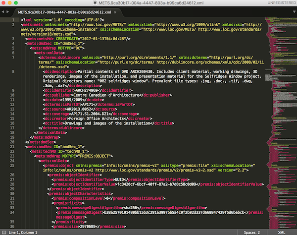
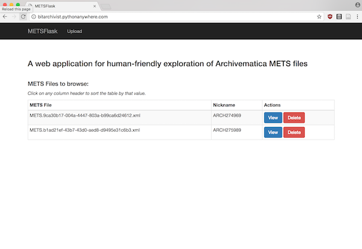
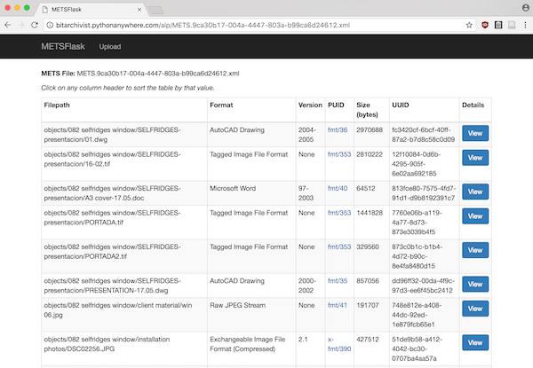
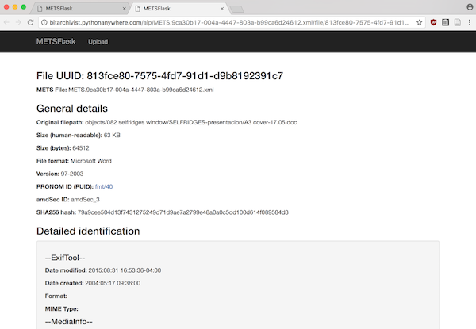
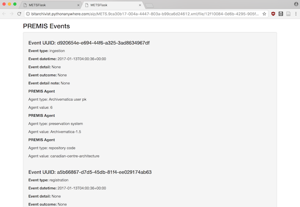
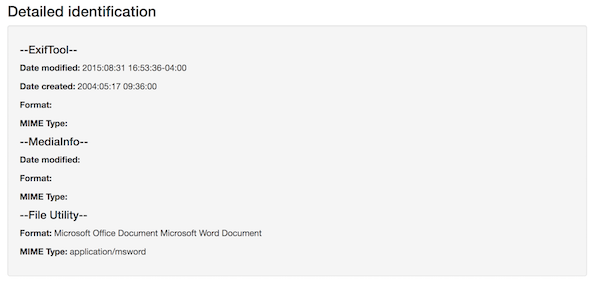
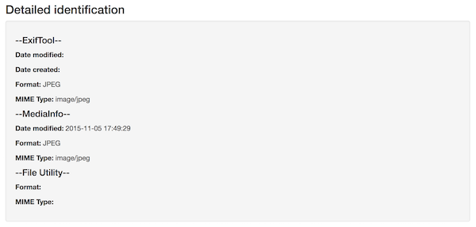
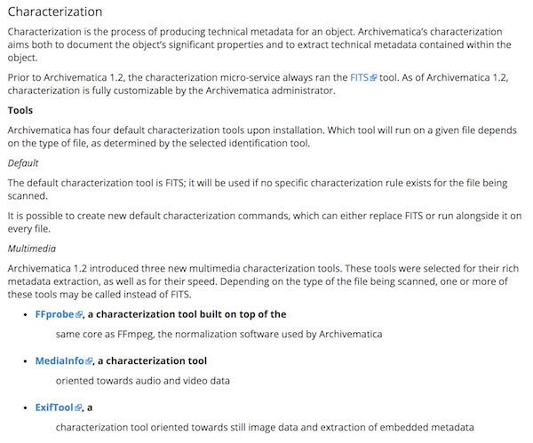
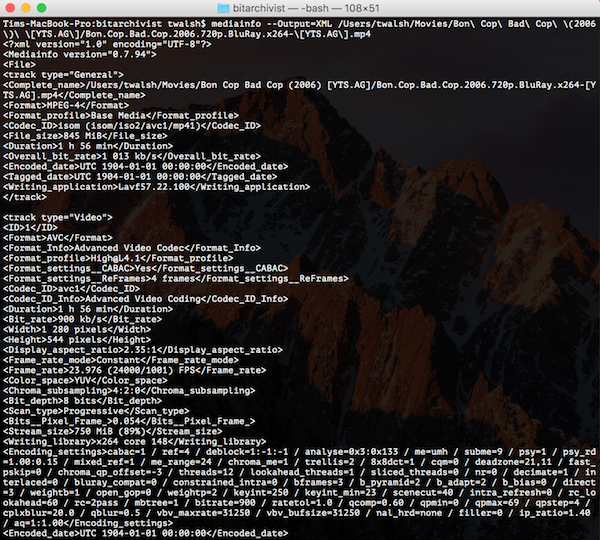

## Intro

A topic I've spent a lot of time thinking about in the last two years at CCA is how to provide access to our born-digital holdings.

To this point, access has been fairly ad-hoc. When a user requests material, files are copied from preserved AIPs in [Archivematica](http://archivematica.org) – or, if the requested material is in our still quite substantial backlog that has yet to be arranged, described, and ingested into Archivematica, from original source media – into a network share that researchers can access on one of two locked-down end user workstations in the CCA reading room (more on these workstations in blog posts to come).

Eventually, we would like to provide access to digital files using DIPs created by Archivematica. These DIPs – as well as the AIPs we currently serve to researchers – consist of copies of the digital objects in their original formats or migrated to preservation/access formats according to CCA's file format policies as well as a crucial supplement: a [METS](http://www.loc.gov/standards/mets/) file containing loads of identification, characterization, and PREMIS Event metadata.



As Marco Klindt said at a recent Archivematica Camp, "[The METS File *is* the AIP](https://www.slideshare.net/Archivematica/premis-in-mets-in-archivematica)". It contains all the information a researcher or digital preservation practitioner needs to know about original files ingested as part of a SIP, their preservation derivatives, and all of the events that happened to both within our care. If we want to give researchers the ability to search, sort, and browse file system metadata as it existed pre-ingest, or if we want to show a demonstrable chain of custody to establish the authenticity of files we're serving to our researchers, the METS file is the key.

But METS files can be awfully hard to read, even for us practitioners. And it's arguably unreasonable to ask our researchers to spend tons of time browsing through very long XML files encoded in a schema with which they are likely not familiar.

So what's to be done?

## METSFlask

What if we could provide an intuitive, familiar user interface for browsing the METS file produced by Archivematica?

After pondering what such a thing might look like for a few months, in late March I decided to try to create a proof of concept web application that would do just that.



The result is (the admittedly boringly-named) [METSFlask](https://github.com/timothyryanwalsh/METSFlask). METSFlask is a web application written in Python using the Flask framework (get the name now?) that allows users to upload METS files and explore metadata from each amdSec associated with a file in the "original" fileGrp of the fileSec. In other words, metadata about each of the original files passed into Archivematica in the SIP.



When a user clicks on the "View" button for an uploaded METS file, they are brought to a sortable table for the AIP, which allows users to sort and browse on a few key pieces of metadata:  

* Filepath ("original" filepath in the SIP)
* Format
* Format Version
* PUID (i.e., PRONOM ID)
* Size (bytes)
* UUID

(Notice there are no file system dates in this table – this is one of the biggest missing features and will be covered in more detail in "Improvements and Next Steps" below.)

When a user finds a file they are interested in, they can click on the "View" button to see a detailed page for that file.



The detailed page includes more metadata for the file (including the amdSec ID, to support going back to the METS file for more information, and the file's hash value). A "Detailed identification" section shows available information from the various Characterization tools Archivematica runs against source files (again, more on this in a bit). Perhaps most crucially, the detailed page also includes a list of all of the PREMIS Events associated with the particular file.



The inclusion of these PREMIS Events opens up our administrative processes to researchers, allowing us to establish trust by allowing users to trace back the chain of custody and interventions related to a file from the time it came into our repository.

## Improvements and Next Steps

I'm more than thrilled with how METSFlask has turned out so far. Given that it was also a reason for me to learn Flask (something that's been on my software development education to-do list for a while), I expected to put together a half-usable application at best. To my surprise and delight, the tool seems already useful and has garnered a decent amount of interest on Twitter.

That said, there are some real limitations and opportunities for improvement.

### Dates

One of the most crucial missing elements in METSFlask is handling of dates. Many researchers have told me that they rely on file system dates for tasks like reconstructing a chronology of a creator's work. (In architecture, this is perhaps especially crucial, as multiple versions of a CAD model might exist in multiple file formats within a given project directory. If you want to piece together which software was used for which purpose – say, for form finding, design detail, rendering, and/or creation of construction drawings – file system dates might be one of the best clues available to you.)

METSFlask does report on file system dates in the "Detailed identification" section of individual file pages, but this reporting is inconsistent.

Compare the results for a Word file:



To those for a JPG:



Metadata such as file system dates are reported by different tools for different types of files, which can be a bit of a problem if you want, for example, to add Date modified and/or Date created not just to individual file pages but to the sortable AIP table view.

The cause of this inconsistency is the default Characterization rules in the Archivematica FPR. Let's take a look at the documentation for Archivematica 1.6:



In short, for the last few versions of Archivematica, users have more flexibility and a wide range of powerful tools available for characterization (yay!). However, Archivematica defaults to using different characterization tools for different file formats, with little overlap. This means that the output written to the METS file can be significantly different between the files in a single AIP. Once you get into the `<premis:objectCharacteristicsExtension>` bit of an amdSec, there isn't any consistency between all of the files ingested. And because file system dates are only recorded as output from tools in `<premis:objectCharacteristicsExtension>`, this means we have no consistent source to extract dates from for our application.

Of course, this can be changed fairly simply. At CCA, we asked Artefactual to use one of our support contract tickets to develop an [Archivematica devtools script](https://github.com/artefactual/archivematica-devtools/tree/dev/issue-11019-ensure-fits-characterization) which adds FITS as a Characterization tool for all files ingested into Archivematica, as an addition rather than a replacement of the tools already being used. If you are using AM 1.6, you can use the script yourself by cloning the archivematica-devtools repo, installing, and running the command:

```
$ cd /path/to/archivematica-devtools
$ git checkout dev/issue-11019-ensure-fits-characterization
$ sudo make install
$ sudo am ensure-fits-characterization
```

*(Thanks to Joel Dunham for writing the script and the simple documentation!)*

After being deployed, METS files in newly-ingested AIPs will contain a Date modified (and sometimes a Date created as well) recorded in a consistent place by FITS that we can add into our AIP Table view, to support the functionality that users requested during informal digital archives access user testing at CCA.

(The addition of this column into the AIP Table view is one of my more immediate development to-dos the next time I get a chance to work on METSFlask.)

### Format-specific metadata

The other big limitation at the moment is that the scope of the detailed metadata available for users on file pages is still rather limited. Characterization tools like FFProbe, MediaInfo, and ExifTool generate a lot of really granular and useful information, particularly for audio-visual formats:



*(For example, check out some of this MediaInfo output for an mp4 of [Bon Cop Bad Cop](https://www.youtube.com/watch?v=UxMuCyzXgC4))*

So far in METSFlask, this information is not represented – in no small part because I was thinking about this project as a proof of concept and the prospect of hard-coding XPaths for every potential output tag from all of the Archivematica characterization tools seemed daunting. In retrospect, there might be a smarter way to do the actual retrieval/coding, but perhaps the first place to start is with a question: **how much and precisely what information do we want to be displaying to begin with?** Any thoughts you have would be much appreciated!

### Database and scaling

Right now, METSFlask is running on a SQLite database, even in production. Because the idea for the app is that files are temporarily uploaded and viewed and then deleted when they are no longer required, this seemed like a fine place to start. But in large-scale applications – say, if you want to upload all of your METS files and keep them in the application permanently – it might be a better idea to run a production-ready database like MySQL or PostgreSQL.

Because METSFlask uses the [SQLAlchemy](https://www.sqlalchemy.org/) object-relational mapper (ORM) to handle database connections and queries, swapping out SQLite for something like MySQL isn't a very big or complicated job. But to this point, it's not one that I've given much time or attention.

Keeping all of your METS files in a local production instance of METSFlask might also require some other changes. Currently, any user can delete any METS file that has been uploaded from the database. This was designed intentionally so that institutions could use the [live instance]((http://bitarchivist.pythonanywhere.com)) of the application without needing to store information from their METS files on a remote server permanently. If a local instance requires that only administrators can delete files, however, the addition of an authentication module and permissions framework that does not yet exist in the application will be necessary.

### Name

A less serious but equally important issue with METSFlask is its name! METSFlask was always intended as a temporary placeholder, but so far a suitable replacement hasn't occurred to me. Perhaps the best suggestion so far is "METSadata" (suggested by Archivematica developer [Holly Becker](https://twitter.com/Hwesta)). It's a good suggestion but I've yet to completely commit to a punny name ;)

All that to say, if you have any suggestions let's hear them!

## Conclusion

I think METSFlask served its original purpose as a "proof of concept" for human-friendly exploring of Archivematica METS files pretty well. And I think there might even be potential for it (or something like it) beyond that initial, limited scope.

But our tools always work better and last longer when they're designed and sustained by a community. I'd love to get your feedback, ideas, contributions, etc., to see if we can't together push this idea to the next level.

METSFlask repo: [https://github.com/timothyryanwalsh/METSFlask](https://github.com/timothyryanwalsh/METSFlask)  
Live instance: [http://bitarchivist.pythonanywhere.com](http://bitarchivist.pythonanywhere.com)