The following is the text of my talk from the recent [2017 BitCurator Users Forum](https://bitcuratorconsortium.org/bitcurator-users-forum-2017), with some editorial notes reflecting changes made to the tool as a result of conversations at the Users Forum.

## Intro

Hi everyone. For those of you who don’t know me, my name is Tim Walsh. I’m the Digital Archivist at the Canadian Centre for Architecture (or CCA), a research museum in Montreal with significant archival holdings in the field of contemporary architecture.

Since 2012, CCA has been the home of a multi-faceted research program entitled Archaeology of the Digital, curated by architect Greg Lynn. This project highlighted 25 key projects in the history of digital architectural design. The projects were interrogated through three exhibitions at CCA and the Yale School of Architecture, two print publications, an oral history project, and twenty-five epublications. Most crucially for this talk, as part of the Archaeology of the Digital project, CCA also collected the archives of each of the projects involved, in some cases other projects by the architects involved, and in some exceptional cases, the entire fonds of the architect or architectural office. This was done to ensure that archives of this key period in architectural history -- roughly the mid-1980s to mid-2000s, where the introduction of CAD and 3D modeling transformed the profession of architecture rapidly -- were preserved and accessible to the public, but also as a means of modernizing CCA’s working practices to the current reality of digital architectural practice and digital archives.

As a result, CCA has collected over the previous years twenty five archives with significant born-digital components. All told, the archives contain roughly 700,000 digital files from a wide range of computing environments, created in a number of different countries, and consisting of a wide range of file formats, including several eras worth of computer-aided design files, custom software, images, video, word processing documents, and more. Many of these archives arrived on a variety of disks that the donors were no longer able to read or had kept unused in boxes -- including one fonds where the majority of the records are stored on 928 CD-Rs.

I was hired in 2015 to lead the project of developing CCA’s digital archives workflows, implement a digital preservation infrastructure, and to begin to arrange, describe, ingest, and make accessible CCA’s digital archives, including but not limited to those collected through the Archaeology of the Digital project. So far much of my work has been focused on building our capacity to arrange, describe, ingest, and preserve the digital archives, and we are just now really getting to the task of processing the archives at scale.

But in the last two years, we have processed a few of the archives and have been making material from even the unprocessed archives accessible.

## Foreign Office Architects fonds

One of our earliest attempts at processing an archive from Archaeology of the Digital was the Foreign Office Architects fonds. This is a large hybrid archive that is the complete fonds of the now-defunct architectural firm Foreign Office Architects. The archive contained over 140,000 digital files which arrived at CCA on over 300 CD-Rs and floppy disks.

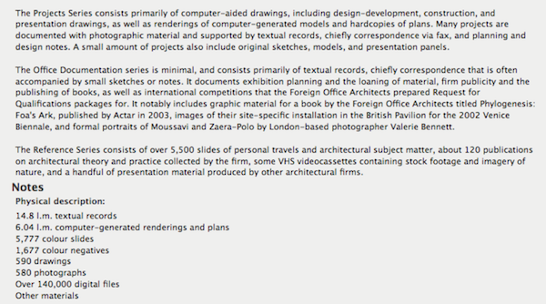

With the archive’s project archivist, we made a work plan for this material and were able to arrange, describe, and ingest the vast majority of the digital files. The processing work -- from disk imaging, to analyzing disk images, exporting logical files, creating archival description, and bagging SIPs to send to Archivematica -- all happened in BitCurator.

What we found in the process is that our workflow largely worked, but the volume of the disks to be processed and the number of manual steps required in BitCurator for each individual disk made the logistics of processing involved and somewhat difficult.

## Automation

Coming off of the processing of the Foreign Office Architects fonds, I began to ask myself some questions. Some of these questions included:

* How can we automate SIP creation from disk images, directories, and network transfers?  
* At which stages of processing and for what types of material is automation appropriate?  
* How do we want our SIPs packaged when they are sent to Archivematica? This is especially crucial because we largely automate the ingest process in Archivematica using automation-tools, and we have made it a priority to include as much submissionDocumentation in our SIPs as is reasonable.  
* Finally, how do we automate the “factual” parts of archival description, so that our processors can spend more time on the things that humans are good at like contextualization and less time determining date ranges and extents?

Eventually, this thinking led me to develop a handful of tools, collectively known as “CCA Tools”, for our processors to use when arranging and describing digital archives. The tools are all available on Github, so I’d encourage you to go check them out when you have the time.

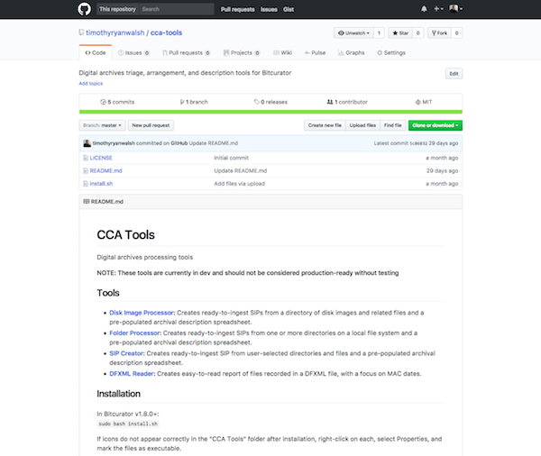

The “CCA Tools” repo on Github also contains an installation script, which installs the utilities in a directory named “CCA Tools” on the BitCurator desktop.

## Why automate in BitCurator?

One good question to ask might be -- why develop for and automate our processing workflows in BitCurator? I doubt that any of you here will be surprised by the reasons, but I think they are still worth listing:

* The tools we’d want to use are already installed as command-line utilities, which are easy to script together  
* Ease of installation and use  
* Ease of sharing tools and processes between institutions  
* When manual attention is required, you have the rest of the BitCurator toolbox at your disposal  

In short, BitCurator is a shared toolbox, and as much as we can do within that toolbox, the better off we’ll be.

## Tools

For the remainder of the presentation, I’m going to go over a few of these tools in some depth, to give you an idea of what the tools do, my thinking behind them, potential use cases, and next steps.

## Disk Image Processor

The first tool I worked on, and perhaps the most crucial among the CCA Tools utilities, is the [Disk Image Processor](https://github.com/timothyryanwalsh/cca-diskimageprocessor).

To give credit where it’s due, the inspiration for the Disk Image Processor came from Jess Whyte’s Disk-ID-md5deep script, which she discussed in the SAA Electronic Records Section blog article linked in this slide. In short, Jess’s script goes through a directory of disk images, uses the disktype utility to determine the file system for each one, and then uses either fiwalk or md5deep to create DFXML files for each image accordingly.

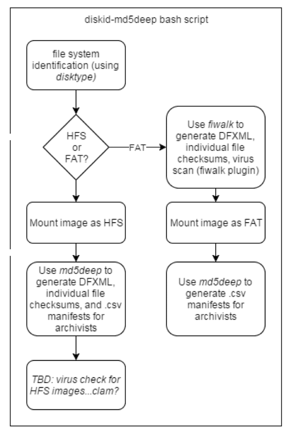

[*Jess Whyte, “Clearing the digital backlog at the Thomas Fisher Rare Book Library,” SAA Electronic Records Section bloggERS!, April 12, 2016*](https://saaers.wordpress.com/2016/04/12/clearing-the-digital-backlog-at-the-thomas-fisher-rare-book-library/comment-page-1/)

I thought (and still think) that this was a brilliant idea, and decided to see how far I could carry the logic.

The result was the Disk Image Processor. Disk Image Processor is a GUI wrapper written in PyQt4 for two Python 3 scripts, that allows users to select which script to use and options, and prints stdout and stderr to the “Detailed output” pane so that they can see exactly what’s going on. The two scripts, “diskimageanalyzer.py” and “diskimageprocessor.py”, can also instead be run directly from a terminal if that fits better into a workflow.

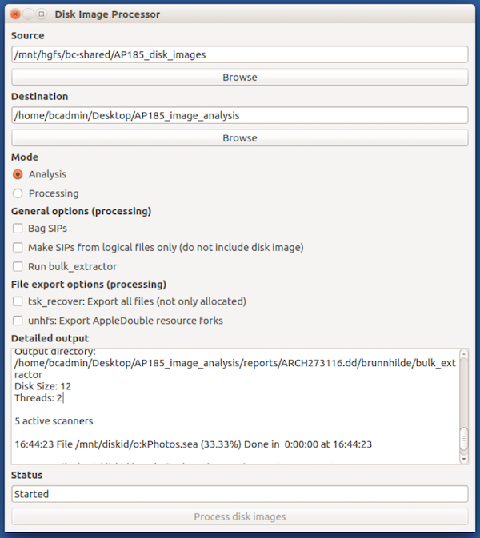

Disk Image Processor has two main uses, each with a separate script and GUI mode. I’ll go over each in a little detail, but first I think it’s maybe good to go over their shared aims. The Disk Image Processor seeks to automate parts of appraisal and processing for the majority of disks in our collection, recognizing that there will always be those that for a multitude of reasons will require manual attention and care. This is done in the dual hopes of efficiently creating consistently packaged SIPs, and also freeing up staff time for tasks where human judgment and expertise is required.

## Analysis Mode

The first of the modes in Disk Image Processor is the Analysis mode.

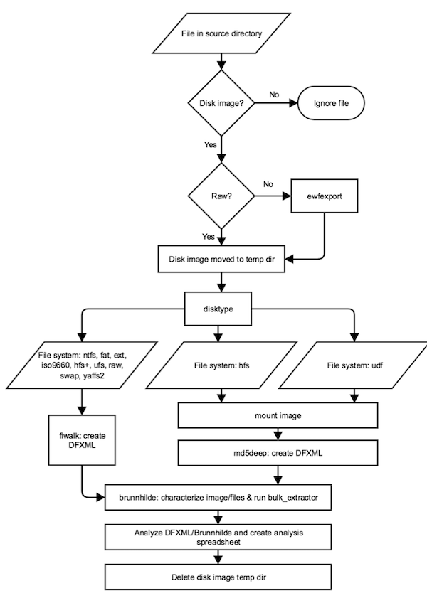

As you can see, the application flow here is a little more complex but very much derivative of the Disk-ID-md5deep script, using disktype to determine the file system of a disk and then routing to appropriate tools to gather information and create reports accordingly.

A more digestible version of the application flow might look like this:

* Determine which files in source directory are disk images (by file extension)  
* Convert any forensic images to raw with [ewfexport](https://linux.die.net/man/1/ewfexport)  
* Run [disktype](https://linux.die.net/man/1/disktype) against each image  
* Depending on file system, use [fiwalk](http://www.forensicswiki.org/wiki/Fiwalk) or [md5deep](http://md5deep.sourceforge.net/) to generate DFXML and save to ”reports” directory  
* Run [Brunnhilde](https://github.com/timothyryanwalsh/brunnhilde) and [Bulk Extractor](http://www.forensicswiki.org/wiki/Bulk_extractor), save outputs to “reports” directory  
* Create analysis spreadsheet  

*Note: Based on feedback from Dr. Alex Nelson of NIST, md5deep has since been replaced by the walk_to_dfxml.py script included as part of the [DFXML Python bindings](https://github.com/simsong/dfxml/).*  

The user specifies the source directory, which can contain both disk images and any associated files such as logs and raster images, and an output directory. The program then writes this into the destination directory:  

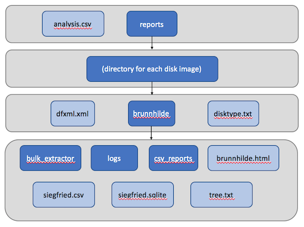

In the top directory is a CSV file containing information on each of the disk images, which we’ll look at a little more closely in a second, and a “reports” directory, which in turn contains a directory for each disk image in the source. Within each disk’s sub-directory are a number of outputs that can be further investigated in BitCurator, including a DFXML file, text output from disktype, and Brunnhilde output, including bulk_extractor logs.

Perhaps the most crucial output is the analysis CSV, which gives the user a high-level overview of each the disks, including the file system, a date range (and which file system dates -- modified, created, or accessed -- were used to construct the range), an extent, a sorted list of the file formats on the disk according to Siegfried/Brunnhilde, and whether any viruses were found by clamAV. Extents and dates are generated from the DFXML file using the DFXML Python bindings, and file format and virus information is taken from output files in the Brunnhilde directory.

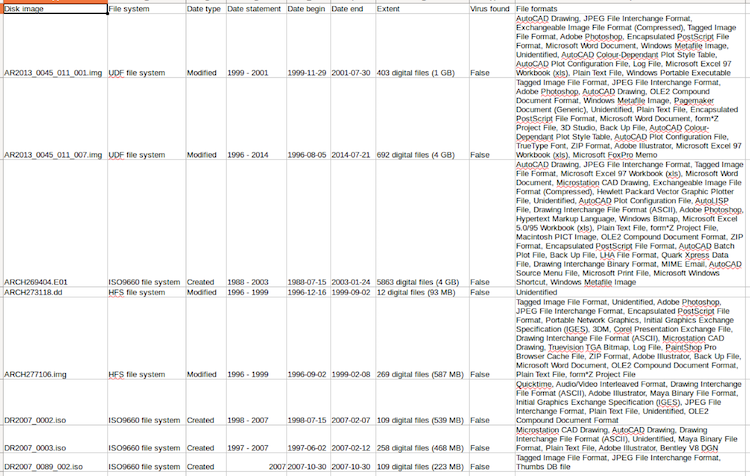

The goal is that, armed with this spreadsheet and the more detailed outputs in the “reports” directory, an archivist should have just about everything they need to make informed decisions about processing before arrangement and description begins. So far in testing at CCA, this has proven essential in creating informed processing plans for our accessions.

Of course -- coming back to that 20% of edge cases I mentioned earlier -- sometimes the tool isn’t quite able to do what is intended. In this case, for instance, a number of the 80 CDs included in an archive were unable to be analyzed by the script:  

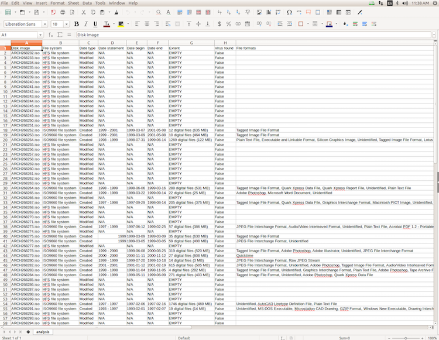

Sometimes this too can be helpful information, as it can flag which disks will require research and manual investigation. In this case, it turned out these “HFS” disks were actually dual-formatted as ISO 9660 and HFS, which prevented the disk from being mounted as an HFS volume and necessitated the use of FTK Imager for file carving.

## Processing Mode

The second mode of Disk Image Processor is the Processing mode. In processing mode, the utility doesn’t only gather and report information about disk images, but actually creates an Archivematica-ready SIP for each one.

The process here looks similar to the Analysis mode, with a few extra steps:

Again, it might be more helpful to look at the application flow another way:

* Determine which files in source directory are disk images (by file extension)  
* Convert any forensic images to raw with [ewfexport](https://linux.die.net/man/1/ewfexport)  
* Run [disktype](https://linux.die.net/man/1/disktype) against each image  
* Depending on file system, use [fiwalk](http://www.forensicswiki.org/wiki/Fiwalk) or [md5deep](http://md5deep.sourceforge.net/) to generate DFXML and save to ”reports” directory  
* Depending on file system, use [tsk_recover](http://www.sleuthkit.org/sleuthkit/man/tsk_recover.html), [HFSExplorer](http://www.catacombae.org/hfsexplorer/), or a mount-and-copy routine to export files  
* Run [Brunnhilde](https://github.com/timothyryanwalsh/brunnhilde) (and, optionally, [Bulk Extractor](http://www.forensicswiki.org/wiki/Bulk_extractor)) and save outputs to metadata/submissionDocumentation  
* Generate file hashes with either [md5deep](http://md5deep.sourceforge.net/) or [bagit-python](https://github.com/LibraryOfCongress/bagit-python)  
* Optionally, store disk image alongside files in objects directory  
* Create description spreadsheet  

*Note: As with the Analysis mode, based on feedback from Dr. Alex Nelson of NIST, md5deep has since been replaced by the walk_to_dfxml.py script included as part of the [DFXML Python bindings](https://github.com/simsong/dfxml/).* 

The destination output of Disk Image Processor is also relatively similar, with a differently-formatted spreadsheet and each SIP split into “object”, “metadata”, and “submissionDocumentation” directories for Archivematica. By default, the “objects” directory of each SIP includes two further directories, which contain a raw copy of the disk image and any associated files with the same basename, and exported logical files, respectively:

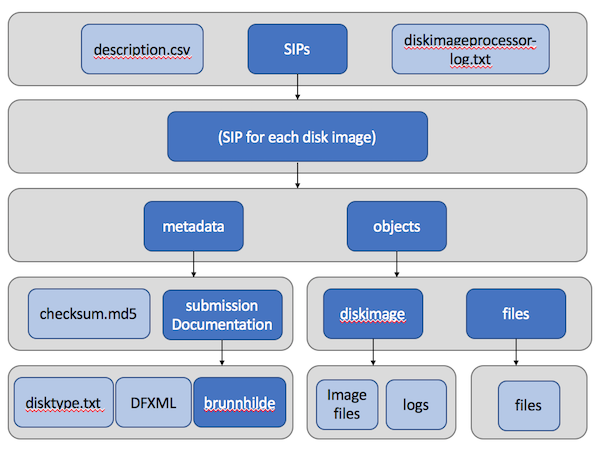

 Optionally, the user can choose to include only logical files in the SIPs:

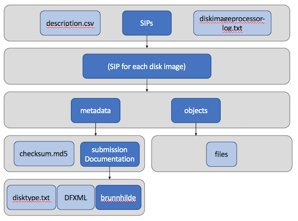

By default, Disk Image Processor includes an md5 manifest in the “metadata” directory of each SIP, but users can optionally choose to have each SIP bagged instead.

As with the Analysis mode, one of the most important outputs of the tool is the CSV spreadsheet, which integrates factual information into archival description for the disk images. 

At CCA, processing archivists take these spreadsheets, change the identifiers to match those in TMS, add a title, verify the dates against the DFXML if needed, and occasionally modify the scope and content as needed, at which point the description goes into our typical review and data entry process for archival description.

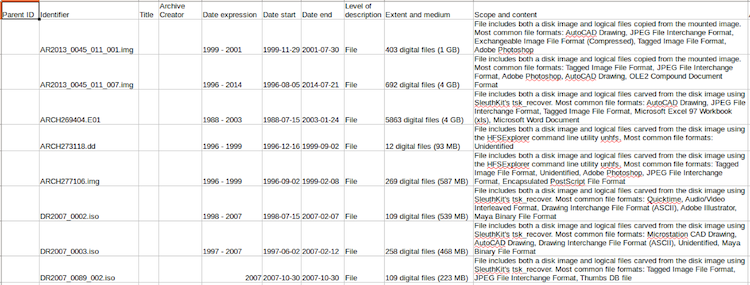

## Use Cases

So, in more concrete terms, when might an archivist might want to use the Disk Image Processor? A few of the use cases I envisioned are:

#### Analysis mode

* To supplement accession records with basic descriptive information about disks and/or disk images  
* To support data-driven decision making during processing planning  

#### Processing mode

* To efficiently process disk images when an MPLP or extensible processing approach calls for minimal effort for maximum gain  

What the Disk Image Processor **won’t** do is support more detailed arrangement schemes, where logical files from a disk are separated into multiple SIPs and units of archival description. Of course, if we’re not treating disks as disks but merely as containers for logical files, other tools might be more appropriate anyway.

## Non-Disk Images

Of course, in practice not all of the digital archives we collect arrive in a form that is conducive to disk imaging. So what do we do for the rest?

The CCA Tools include two tools meant specifically for network transfers and other cases where no disk images are involved. I’m going to go through these much more quickly than the Disk Image Processor, in part because they share a very similar logic, and so that we have to time to briefly cover next steps at the end of the presentation.

## Folder Processor

The first of these, [Folder Processor](https://github.com/timothyryanwalsh/cca-folderprocessor), is intended for a use case where an archivist wants to create a SIP for each of any number of selected directories.

The program offers a checkbox interface so that the user can select precisely the directories they want to create SIPs from, and gives the options to bag the resultant SIPs and/or run bulk_extractor against each as part of the processing workflow.

Each SIP has the following structure, similar to those put out by the Disk Image Processor, with “objects”, “metadata”, and “submissionDocumentation” directories, and a description CSV -- the only real difference in outputs being the lack of a disktype text file.

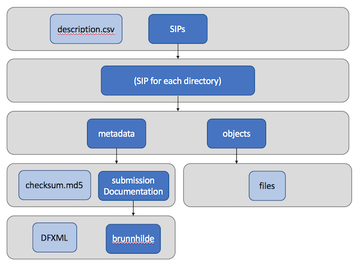

## SIP Creator

The [SIP Creator](https://github.com/timothyryanwalsh/cca-sipcreator) is a very similar utility, but intended for somewhat the opposite use case. It enables an archivist to create a single SIP from any number of individual directories and files. This enables more manual arrangement than is possible through the Folder Processor.

The output is nearly identical to the Folder Processor, except that it contains only one SIP:

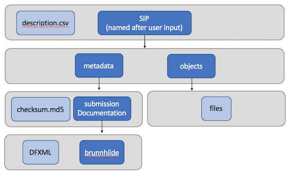

## Next Steps

So what are the next steps for this project?

There remains a good amount of development and debugging to do. Because the intention is to apply these tools against materials created in several decades worth of computing environments around the world, some of this debugging will require more testing and feedback as issues come up with file systems, tools, character encodings, and so on. I’d encourage you all here to try out the tools if they seem useful to you and report any issues you might come across on Github, which would definitely help in this testing phase.

More generally, I’d consider the tools at about an alpha status at the moment. To get them to beta and eventually to a stable release, there are a couple of things I’m considering.

One is potentially replacing tsk\_recover as a file carving utility, maybe with a mount-and-copy routine, like Disk Image Processor currently uses for UDF discs. This is because tsk\_recover does not retain original file system dates when exporting files, which is less than ideal because then original MAC dates don’t get passed to Archivematica except through the DFXML file.

There’s also some more thinking necessary about how the CCA Tools utilities build extent statements, specifically in which FileObjects in the DFXML file are counted as “files” in the extent statement. The utility currently counts any FileObject as a file, even if that FileObject actually represents, for example, the current directory or an OphanFiles directory. It’s certainly possible to filter these using the name_type tag in the DFXML, but because md5deep-generated DFXML files don’t contain this tag, consistency across the various tools utilized will require some further thought. It also might be good to build in some sort of check to flag instances where the file count reported in the DFXML differs significantly from the number of files exported to the “objects” directory.

*Note: Disk Image Processor now counts only true files in extents by filtering on name_type in DFXML. This was made possible by use of the walk_to_dfxml.py script.*  

On a more technical level, I’d like to build some more consistency into the code of the utilities. Right now the CCA Tools run on both Python 2 and Python 3, because Python 2 is required to support the PyQt4 GUI wrappers and Python 3 is required to avoid errors in parsing DFXML using the DFXML Python bindings. Eventually I’d like to migrate the GUIs to PyQt5 and use Python 3 exclusively, but this isn’t yet work that I’ve planned out. 

There’s also the description. At CCA, we do not yet have an archival management system that we can feed description into via CSVs, XML, or other standard inputs, so although the description.csv files CCA Tools produces are based on the ISAD(G) import spreadsheets for AtoM, we still have to copy and paste description into our database during data entry. But this won’t be the situation forever, and (luckily) isn’t the situation for everyone, so it seems like a worthy project would be to standardize the CSV outputs of the tool so they are able to be automatically imported into software like AtoM or ArchivesSpace, eliminating another unnecessary timesuck for our processors.

Finally, my hope is that the CCA Tools inspire some dialogue about what we might want automation tools for digital archival processing to look like. I’ve made a lot of assumptions in the design of these tools, and I don’t yet have many other eyes and voices involved to challenge those assumptions and test them against real collections. As fun and great as writing scripts to make our lives easier is, I’m also conscious of the danger in staking the success of our scaled-up processing on what is basically a proof-of-concept tool developed and maintained by a single amateur coder. If we can collectively, design, use, and maintain core utilities through collaborative projects like the BitCurator Consortium, we’ll all be better off for it. Maybe now, while we’re gathered here together, is a good time to ask what these tools for scaled-up processing should look like and what they should (and should not) do.

## Thanks

Thank you all for listening. Please [check out the utilities on Github](https://github.com/timothyryanwalsh/cca-tools), and I’d be happy to answer any questions you might have, whether now, later on in the day, or any time through Twitter or email.