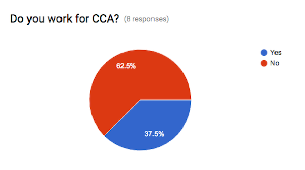
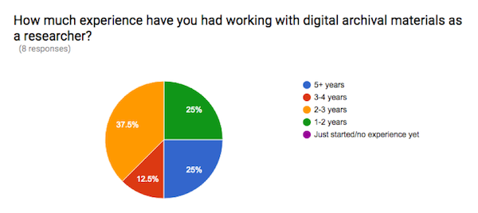
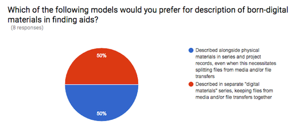
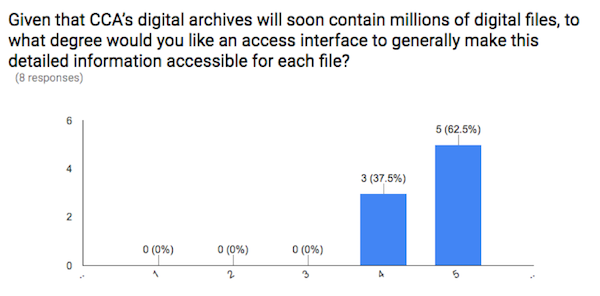
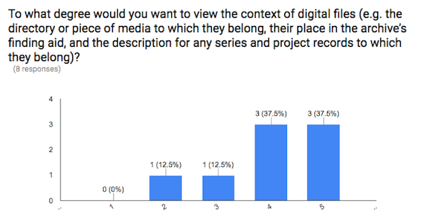
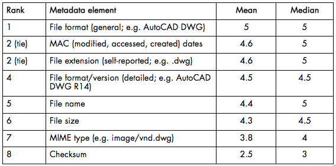
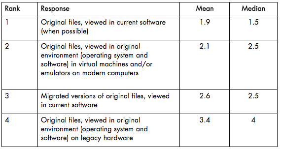

## Intro

In order to better understand the needs and desires of the Canadian Centre for Architecture (CCA)'s users regarding access to the born-digital archives, I wrote and distributed a survey in September 2016 to the CCA research community. The survey was distributed to 19 people, including:

* Researchers who have worked with born-digital archives in the CCA Study Room;  
* Visiting lecturers on digital architecture who have had experience using (paper and/or digital) archives at CCA and/or other collecting institutions; and  
* Current and former CCA curatorial and publications staff who have used CCA’s digital archives as source material for projects such as the Archaeology of the Digital exhibitions and publications.

The intention of the survey was to gather information regarding user needs and experiences with digital archives. Although archivists have published on access from the perspective of what collecting institutions are doing, there is not much precedent for this type of user survey. The only example I could find, “[Researcher Interactions with Born-Digital: Out of the Frying Pan and into the Reading Room](https://saaers.wordpress.com/2016/01/28/researcher-interactions-with-born-digital-out-of-the-frying-pan-and-into-the-reading-room/)” by Julia Kim, involved close observation of the research behaviors of five users of digital archives at NYU. Unless other institutions simply are not publishing their results, it seems that institutions have not yet done much research gathering about the expectations and needs of users of born-digital archives.

There were 8 responses to the survey, which were analyzed in October 2016. A more detailed summary and analysis of the results by survey section follows. Although the sample size and selection preclude taking too much stock in any universal or generalizable conclusions, some key highlights might include:

#### User Skills and Intentions

* CCA staff and researchers working with the digital archives are not new to this endeavor and self-identify as having high levels of expertise as users of archives, legacy/obsolete digital files, and design (CAD/BIM) software.   
* CCA staff typically interact with the digital archives through curatorial (exhibition and publishing) endeavors.
* Outside researchers are interested in more than just the form or end result of a project, and may be seeking to answer questions about workflow, the two-way relationship between design and particular technologies, and the organizational practices/knowledge management of firms.  

#### Description and Discoverability

* CCA staff and researchers are split on the question of whether digital files should be arranged and described alongside physical materials or separately. This reflects very real compromises with either solution, and a legitimate desire for multiple arrangements/ways of looking at the archive not currently supported by archival technologies.  
* CCA staff and researchers want to be able to search, sort, and browse through extensive item-level metadata for the individual digital files in the digital archives. They want to be able to do this within archives as a whole and within particular projects, while seeing the archival context for each individual digital file. While Archivematica does gather this information in a way that would be indexable, this suggests that discoverability that matches our users’ stated needs will require using that information in some sort of end-user interface.
* 100% of respondents answered that they would want an access interface to provide detailed item-level records for each individual digital file.

#### Access and Use

* CCA staff and researchers prefer working with original digital files from the archives on current software and machines, closely followed by working with original files within legacy software environment in emulators and/or virtual machines. These approaches should be pursued in parallel. 
* CCA staff and researchers require varying degrees of technical support when working with digital archives. Generally-applicable guides to working with particular formats may have the largest positive effect for researchers and staff alike.

#### Local vs. Remote Access

* Although the approach cannot meet all research interests and needs, most CCA staff and researchers find dedicated, locked-down Study Room workstations an acceptable mechanism for access.
* Several of the respondents suggested that a balanced, reasonable solution to long-distance access might be providing VPN connections to CCA’s dedicated Study Room workstations following user registration with Reference.

## Detailed Analysis

#### User demographics

Five of the respondents (62.5%) were non-CCA affiliated researchers. Three of the respondents currently or formerly worked at CCA.

Among those who are not CCA affiliated, two identified as professors and one as a PhD student. The remaining two non-CCA respondents did not supply their job title or affiliation. The only job title supplied by a CCA-affiliated respondent was “curatorial advisor”.

The respondents show varied levels of experience working with digital archives and obsolete file formats. Given that the survey was distributed to a small, hand-picked sample of people, it is perhaps not surprising that all respondents had some experience working with digital archives. It is perhaps a bit surprising, however, that the responses show some significant experience: the median experience working with digital archival materials was 2-3 years. One respondent had 3-4 years experience, and two had 5+ years.

The most common answers to the question “What is your level of familiarity/comfort working with obsolete digital file formats and software?” were Medium and High. Similarly, every one of the eight respondents indicated that they had either Medium or High familiarity/comfort working with computer-aided design (CAD/BIM) formats.

Together, these responses indicate that the CCA research community interested in and working with digital archives to date has a sophisticated set of skills and abilities. 

This is further supported by the free-form responses to the following two questions:

**1. Describe your primary purpose for interacting with born-digital archival material at CCA or elsewhere.**

Responses to this question from CCA staff underscored the uses of digital archival material in various forms of curatorial and publishing output. Sample responses:

> *"Selecting material and preparing files for publication (digital or paper)"*

> *"Working on the epubs for the Archaeology of the Digital research program is the main context for my interaction with this material."*

> *"curatorial and prep for archival contribution"*

Responses from non-CCA affiliated researchers indicated various types of scholarly output. The primary focuses of such scholarship included inquiries into the complex relationship between design and technology, and inquiries into the working practices of architects and architectural firms. Responses indicate that serious research into the former topic requires a thorough understanding of and ability to interact with legacy design tools. Sample responses:

> *"Understanding workflows and methodologies, levels of detail for different types of projects, etc in the service of constructing the relationship between exact design methods and digital technology."*

> *"For scholarly research as a historian."*

> *"So much of early digital practice involves the collision of intent with the limitations and proclivities of certain specific tools. Without deeply researching the tools themselves, and the files and formats associated with them, there is no way to effectively understand such conceptual and literal transactions"*

**2. What are the types of research questions you would seek to answer by accessing born-digital archival material in CCA's Collection?**

Responses to this question went into slightly more detail on the topics raised in Question 1 above. These responses can be roughly broken into a few categories:

a. Inquiry into the effects of design tools (i.e., software)

> *"How did software development impact visualization and design practices? Can the setting of the projects development be traced? Insights on the design process: history of the files, information about the role of software used, its development (communication with other disciplines, production). What role did scripting play in a specific project. Information about the hard- and software."*

> *"The extent to which successive revisions of work came closer to, or further from, restrictions of the software."*

b. Intersections of software tools and working practices/project organization

> *"Design workflow questions and inquiring about types of software used within the design workflow"*

> *"The same sort of questions I would ask of any archive that includes working drawings, correspondence, etc. What was the thinking that went into the design of X? However, born-digital archives might provide more evidence for questions about how the technical knowledge of a whole range of architectural designers (from a principal to interns) affected the design of a project."*

> *"What types of project organizations were used to develop bespoke design tools among diverse groups of experts? How was digital content organized for custom machine control? What were practices around scripting and knowledge sharing? Also there are a range of interesting organizational behavior/sociological questions that come from the accessibility of full email archives."*

c. Questions about how to represent and publish digital archival material

> *"For now, relatively practical questions that weigh on how to publish projects for which the material we have is primarily digital. I'm approaching the archives with the goal of understanding all the material that exists and how it interrelates. So, for example: What software was used to develop a project? What was the file structure the office used? How often were files created and saved? What was the interaction between different types of software, and between 2D and 3D? Were the files shared with other people (e.g., internally, or externally with contractors)? On what dates were the files created? I often feel like I might be ‘missing’ something because I can't open a particular file, or it's missing links, or whatever, so I want to feel that I understand its role in the archive as a whole."*

> *"What was the nature of the material as architects created it and interacted with it? How can this material best be presented in print and digital publications, with the least amount of translation across formats?"*

The final question in the demographics section of the survey asked, “Are there models for providing access to born-digital archival materials you have seen elsewhere that worked well for you as a researcher?” By far, the most common answer was some variant of “No”. Some of the more interesting responses included:

> *"I found it very interesting going through the 'raw' archive of architects to see how disorganized their filing system was. It was also a big surprise for them to see how their practice has evolved looking back at their old files."*

> *"Things are very much in their infancy. Different filing systems from project to project is an issue everywhere. I also think that imagery extracted from a model allows the simpler browsing and categorization of 3D assets, even if the views are only for indexing purposes. This helps with ‘browsability’ enormously. For instance when working with Gehry's archives screenshots of models were often essential to understanding use cases as well as content within the models themselves."*

> *"I have seen very few models of how to provide such access, but the Prelinger Archive has been a great resource here in San Francisco. (not for architectural work however.)"*

#### Research tools and strategies

The first question in this section asked researchers about their level of familiarity with archival standards, practices, and research tools (i.e. finding aids). All of the respondents had at least some level of familiarity. On a scale of 1 (not famililar) to 5 (very familiar), the median answer was 5 and the mean was 3.9. This indicates that most of CCA’s staff and researchers working with digital archives self-describe as having a high level of understanding of archival practices and research tools.

The next question asked, “Which of the following models would you prefer for description of born-digital materials in finding aids?”. The question offered two choices:

1. Described alongside physical materials in series and project records, even when this necessitates splitting files from media and/or file transfers; or  
2. Described in separate "digital materials" series, keeping files from media and/or file transfers together.

The question addresses something of a dilemma resulting from the currently-available tools to CCA: without having any way offer multiple versions of arrangement to digital archives, staff must choose between retaining original order/clarity of the originating source of digital files and integration of physical and digital records in series and project records.

Perhaps unsurprisingly, the answers to this question were split evenly. This split opinion is reflective of similarly divided conversations at CCA on the same subject.

A number of users offered comments to clarify their position on the above question. Interestingly, the comments were overwhelming in favor of arranging/ describing physical and digital records together, citing the working practices of creators and ease of use for researchers. Such responses included:

> *"It feels too easy to ‘split’ the digital from the physical anyway, so I think it would be better not to reinforce this at the level of the series. From our interviews with architects we know that the physical and digital were often part of a back-and-forth process (e.g., for BMW welt, models were scanned in 3D, then digitally manipulated, then the models were cut and remanipulated physically). If we are cataloging based on projects then to me it makes sense to include digital alongside physical because they are part of the same conceptual workflow."*

> *"I find it very useful to include digital material within given project records because as a researcher, I am more concerned about knowing which files relate to which project."*

> *"I don't have a strong opinion but feel that ultimately these resources will be increasingly accessible and therefore integrated into the more general project records. Moreover, particularly in early projects, there is a reciprocity between anolog* [sic.] *and digital resources which is essential for proper interpretation."*

> *"As architects work with physical and digital materials to develop a project, I think both kinds of material should be described together."*

Two responses in particular seem to warrant further analysis:

> *"I would say that it should be the other way around than option 1: as more and more projects are born digital, it makes sense to correlate the physical material with the digital series. For example, correspondence, models, and drawings could be correlated with their "original" version - an email (which was printed), a digital model (which served as a template or reference to build the physical model), or a cad file (which was plotted). With some projects the original archive is digital, and the physical material is derived from it."*

> *"Ideally one would have both."*

[ed. note: This latter response (however short) is my opinion as well, and also seems backed up by the findings of Julia Kim at NYU. Even for entirely digital archives, there would be enormous value in enabling researchers to switch between multiple arrangements of the same archive; for instance, to see in one pane the digital files as they were originally organized by a firm, and then in a second pane to the see same files as arranged to facilitate easy discovery of like records. Actually enabling this sort of behavior will take new tools and perhaps some deep thinking about how archival description should or should not adapt to the realities of a digital environment where directory hierarchy is only one of multiple possible ways to organize and retrieve material.]

The final question in the “Research tools and strategies” question asked staff and researchers to rank the following methods of digital file discoverability in terms of their usefulness for research:

1. Ability to search and sort files across the CCA Collection  
2. Ability to search and sort files with an individual archive
3. Ability to search and sort files by what belongs to a particular architectural project

CCA researchers most want the ability to search and sort files within an individual archive. This was very closely followed by the ability to search and sort files within a project. By far the least popular option was the ability to search and sort files across the CCA Collection -- 7 of the 8 respondents ranked this as “least helpful”. Interestingly, the 8th respondent ranked this choice as “most helpful.”

#### Metadata

The metadata section of the survey sought to explore several fundamental questions related to discoverability of digital files in CCA’s archives: How much information about each individual digital file do CCA staff and researchers want? Where do they want to see this information? Finally, from among the many types of metadata available for each individual digital file once it has been processed through Archivematica, which are the most important to promote discoverability and, once a file has been found, understanding of its form and contents?

The survey responses very clearly answer the first question: CCA staff and researchers overwhelmingly want access to detailed information for each individual digital file in the CCA Collection. On a scale from 1 (don’t want) to 5 (very much want), the median answer was 5 and the mean was 4.6.  

CCA’s staff and researchers were also very clear on where they would like to view this information. When asked “Where would you like this information to be viewable?”, 100% of respondents answered that they would want an access interface to provide a “detailed item-level record for each file (e.g. click-through from search/browse mechanisms)”.

Survey respondents also made it clear that CCA’s research community wants the archival context of digital files to be plainly represented for all digital files. On a scale of 1 (don’t want) to 5 (very much want), the median and mean answer to this question were both 4.

As in the answers to the preceding question, the most common answer (6 respondents) to where such information should be provided was in a detailed item-level record for each individual file. Other less popular answers included in a spreadsheet or other external documentation (2) and findable via identifier in CCA’s web search and/or finding aids (2).

Finally, this section asked respondents to rate a list of metadata elements that can be supplied via Archivematica’s METS files to aid in discoverability and usability of digital files. Respondents were asked to rate each type of information on a scale of 1 (don’t want) to 5 (must have), 3 being neutral.

The following chart illustrates the responses, ranking each metadata element by its mean score from highest to lowest:

There perhaps aren’t many surprises here -- generally, one of the takeaways is that researchers seem to value all of the metadata for a file that CCA is able to provide.

Users were asked to leave a comment if they felt the list above was incomplete. Four of the respondents offered additional suggestions. Relatively simple (if, perhaps, difficult to implement) suggestions included the number of times a file recurs/if duplicate copies exist and thumbnail images for raster and vector image files. One respondent answered, *“Native hardware, can it be viewed online, can it be viewed at the CCA”* -- questions that can perhaps be better answered in aggregate levels of description such as fonds and series descriptions. One comment focused on possibilities of automatically generating thematic metadata by leveraging machine learning technologies, but pointed out that such activities are more likely to be the work of researchers than of CCA.

#### Access and use

The “Access and Use” section, the last substantive section of the survey, sought to shed light on a larger question, namely, what types of environments should access and use of CCA’s digital archives happen within?

The first question in this section asked respondents to rank different access mechanisms for obsolete digital files. The options included:

1. Original files, viewed in current software (when possible)  
2. Migrated versions of original files, viewed in current software  
3. Original files, viewed in original environment (operating system and software) on legacy hardware
4. Original files, viewed in original environment (operating system and software) in virtual machines and/or emulators on modern computers

The following chart illustrates the responses, ranking each response by its mean score from lowest to highest (the lowest score in this case corresponding to the highest rank):

By both mean and median score, the most popular option was viewing original files in current software (when possible).

By mean score, viewing files in emulated/virtualized versions of their original software and hardware environments came in a close second, followed relatively closely by viewing migrated versions of original files in current software. By median, emulation and migration were tied as the second-place option.

By both metrics, the least popular option was viewing original files on legacy hardware.

Respondents were also asked to leave comments on the question above. All four comments focus on the affordances (pros) and costs (cons) of maintaining original environments, whether on legacy hardware or in emulated environments. The responses are included here in their totality:

> *"I think creating a library of virtual machines would be the most efficient option. Thinking back through the 90s, fewer than a dozen would likely be required to capture the vast majority of hardware/software environments used by architects. I think the CCA library would be doing a tremendous service if it were to try to collect software as part of its library (i.e., ask McNeel for copies of Rhino from 1989 to the present; just the installation files and a license key that would work in a "standalone" virtual machine). This would take some negotiation, but once it was done and an appropriate series of virtual machines was set up to run them, this would be a truly unique and invaluable resource for scholars."*

> *"This is very difficult. I rank these in this way primarily because the cost and overhead associated with original hardware and software would reduce the total number of resources that could be made available. In addition, there are enhancements in current software which could make the analysis of older files actually more useful. Of course there is a risk of losing data, so some attention must be paid to the migration process. But viewing the files on original software may at any rate not be possible, or subject to licensing restrictions. So I favor a pragmatic solution."*

> *"Original files in original environments give the deepest insight into the architects' working methods in my opinion."*

> *"That is for straight research purposes; when it comes to publishing the material the question becomes different. Either way I feel like the answer is too easy, because I don't actually expect legacy hardware to be available."*

The second question in the Access and Use section asked respondents about their expectations with regards to who will conduct the labor of making obsolete file formats usable. The question, “To what degree do you expect CCA to resolve technical problems related to file format obsolescence, software obsolescence, and the like vs. providing you with copies of original digital files and letting you figure it out on your own?”, solicited a range of responses. Respondents were split as to whom should be responsible for working with file format obsolescence in the archives:

a. Technical support by CCA

> *"Give support in resolving technical problems. Interesting option to work with original files, yet time consuming."*

> *"It’s the only hope."*

> *"I would expect the CCA to resolve all technical problems related to access before making the files available."*

b. No technical support by CCA

> *"I would be happy to figure it out on my own, and that would certainly be the only feasible option in the short term. I think drafting new rules to allow flexibility in a self-contained digital environment is a great idea. Because no original files would be harmed, the CCA can and should allow total freedom in software and digital files on virtual machines. As I mentioned above, a long-term goal of collecting software/licenses and virtual machines would be a fabulous institutional goal."*

> *"Personally, I'm a realist about this and don't expect the CCA to resolve so many technical problems. As long as there is some baseline current tools available I would expect that a researcher in this space would be resourceful enough to find solutions."*

> *"Knowing the CCA, I am fully aware that there limitations to what can be done to resolve technical problems but I feel that since these digital archives are quite dated, a researcher would have to assume that some files will perhaps never be recovered and they would have to be willig [sic.] to accept that as fact."*

One respondent offered a reasonable middle-ground solution, stating, *“You wouldn't need to do this for each file, but maintain a knowledge base of formats and how to work with them.”*

The next two questions in the section asked respondents to comment on whether accessing digital files in the archives on locked-down workstations in the Study Center are sufficient for their research needs. Five of the eight respondents answered that locked-down workstations are sufficient for their research purposes. One responded “not applicable.” The other two responses were:

> *"For many uses this is fine but there can be external tools which are useful to apply to certain types of files. In addition doing big-data style analysis is obviously not possible on lockdown."*

> *"Not totally but somewhat."*

Asked to add more detail on why this approach may not work for them, two respondents mentioned the time and resource barriers implicit in having to physically travel to Montreal. The other answer, while encouraging of CCA’s work to date, again discussed types of research not possible on locked-down local workstations:

> *"I've been doing a lot of work lately which is more comparative - collecting information from many projects and find emerging trends. This requires itself custom software and the ability to traverse a full set of archives in realtime (i.e. all the data is available at once), which would be tough in the reading-room style. But I also acknowledge that for most historical uses the reading room approach is a healthy start and is sufficient in many cases, especially for discovery."*

The final question in this section asked respondents for feedback on how CCA might provide more remote access given our donors’ understandable reluctance to make files freely available for online download. Of the seven responses, one respondent commented that they felt *“it’s reasonable for [the digital archives] to be housed in a physical location.”* Another respondent suggested making portions of the archives available in curated environments (e.g. web articles, ebooks). Four of the seven respondents directly or indirectly suggested remote online access to CCA’s dedicated workstations via VPN, following standard registration with Reference. These responses are worth listing in their entirety:

> *"I think the CCA would need to test VPN-like solutions and prove to the donors that this can be done safely. It's only a matter of time before donors begin to wrap their heads around the inherent digital nature of their archives and what that truly entails."*

> *"access to archive after registration with the CCA"*

> *"Is there some sort of VPN solution? Is that sustainable?"*

> *"It would be easy to set up a permission-only vpn for access to files via a non-downloadable interface; if the application process were detailed and specific enough I can imagine a staff person approving access on a case-by-case basis, although this would undoubtedly need more staff support than simply supervising a local machine."*

#### Final comments

Finally, respondents were asked to give any final comments they might have. Many of the comments expressed interest in and/or gratitude for the survey. One of the responses gave an interesting opinion on digital archives and their relation to physical archives, shared in its entirety here:

> *"I personally believe that simpler systems with more generic but consumable content will be necessary to scale the digital archives. I'm also fascinated by some of these big data questions, even as they might be applied to the digitization of existing materials. This is the flip side of the digital archive: for example, imagine the digitization of the physical model archive using something like 123D Catch or similar technology. A relatively cheap process that could vastly increase accessibility and relevance. There are some ways in which the digital and physical archives could converge that could be really amazing."*

## Conclusions, Caveats, Next Steps

Despite the small sample size and the fact that data is likely skewed by the fact that the respondents were all early adopter users of the digital archives, I think there are a number of interesting points to go through, particularly regarding user desires and use cases, understanding and even demand for software preservation/emulation, and the desire of researchers to be able to search, sort, and browse through both archival context and item-level metadata.

From this survey, I am now working on a more standard "exit interview" we can give researchers to record their experiences, limits, frustructions, and victories working with the digital archives. Hopefully from this work we will also get a better sense of the use cases for digital archives from a researcher's perspective. Although this has already been happening in an informal way, formalizing the exit interview script should help us identify trends in the resulting data.

As we discussed at the recent BitCurator Users Forum, designing solutions that work for access to digital archives will require us first to understand our researchers and their use cases. To date, there hasn't been very much data to work with in this regard. So, as a community of archivists, librarians, digital preservation practitioners, etc. - let's get on it!

Perhaps a unified effort to collect use cases across different repositories might be a good step -- something similar to efforts by the [Software Preservation Network](http://www.softwarepreservationnetwork.org/) (hi, SPN!) in the software preservation space. Is this something that's already being done? If not, what might an appropriate organizational "home" be for such a project?